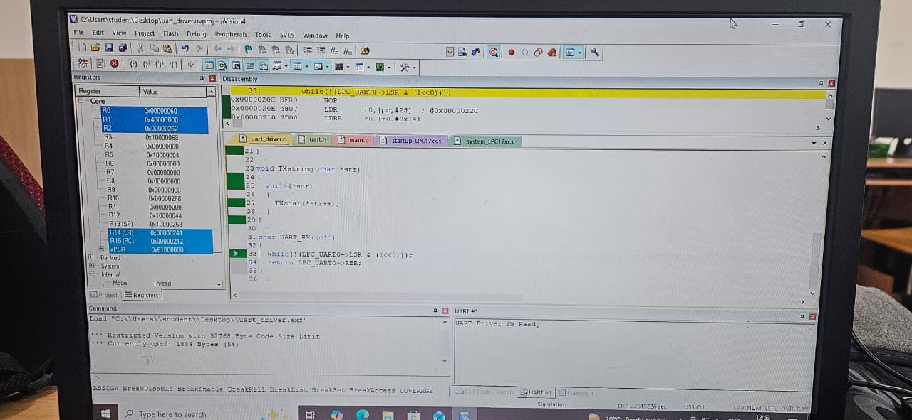

# Final Day

# OUTPUT in simulator of keilluvision

- As you can see in the screenshot, the UART driver was properly initialized and Was waiting for an input to echo it back
- Since no such input was given, the UART waits indefinetly
